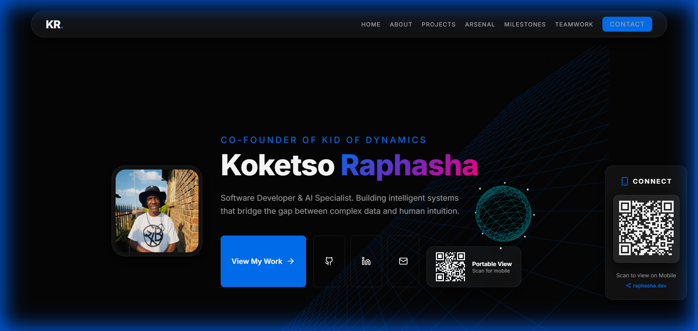
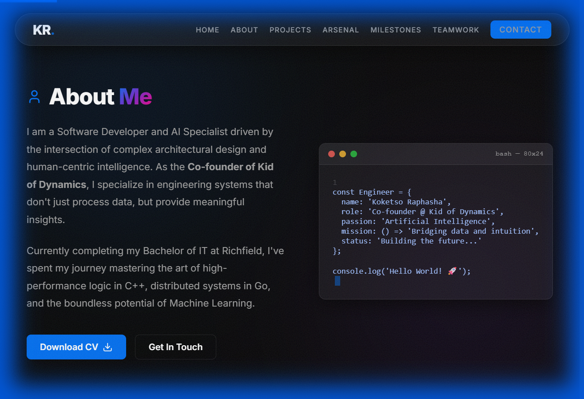
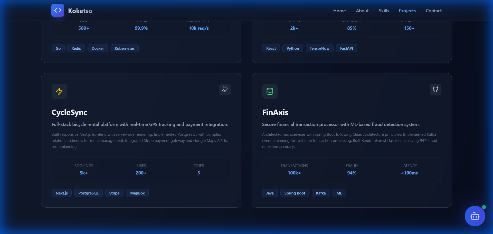
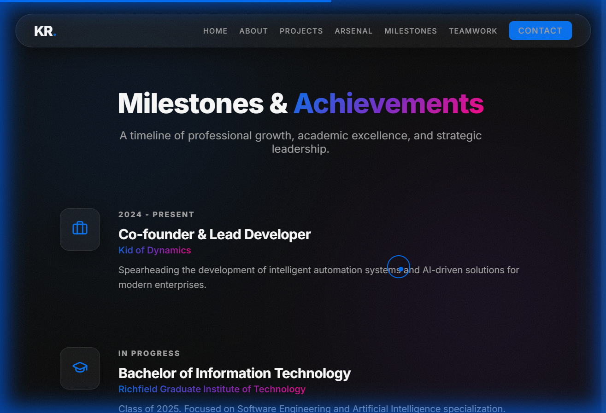

# 🚀 Professional 3D Portfolio - Koketso Raphasha

A dynamic, high-fidelity portfolio website built for a Software Developer & AI Specialist. This project utilizes cutting-edge web technologies to create an immersive, luxury digital experience.

**Live Demo:** [https://portfolio-drab-five-89.vercel.app](https://portfolio-drab-five-89.vercel.app)

---

## 📸 Visual Masterpieces

### 🤖 Hero & Neural Core
*Featuring the custom-engineered 3D Neural Sphere and real-time connectivity widget.*


### 💻 Technical Persona
*A deep dive into the engineering mindset with integrated bash terminal simulations.*


### 🏆 Featured Projects
*Showcasing FlowSentinel, AI Job Market Intelligence, and more with high-performance metrics.*


### 📈 Professional Milestones
*A chronological timeline of leadership roles, academic excellence, and certifications.*


---

## 🛠️ Tech Stack & Arsenal

- **Frontend Core:** React.js, Vite (Migrated to CRA for stability)
- **3D Engine:** Three.js, React Three Fiber, React Three Drei
- **Animations:** Framer Motion (Scroll reveal, Magnetic effects)
- **Styling:** CSS3 (Modern Glassmorphism, Dark Themes)
- **Icons:** Lucide React
- **Connectivity:** QRCode.react (Functional Mobile Cross-Platform Sync)

---

## 🌟 Key Features

- **3D Neural Network Sphere:** An animated, reactive Three.js model representing AI intelligence.
- **Dynamic Scroll Reveals:** Advanced motion-driven UI that responds as you navigate.
- **Functional Mobile Scanning:** Integrated QR codes that allow instant mobile viewing via local network routing.
- **Glassmorphic UI:** Premium design system with high-transparency layers and vibrant accents.
- **Lead Developer Identity:** Personalized content celebrating the Co-founder role at *Kid of Dynamics*.

---

## 🚀 Getting Started

1. **Clone the repository**
   ```bash
   git clone https://github.com/Raphasha27/Portfolio.git
   ```

2. **Install dependencies**
   ```bash
   npm install
   ```

3. **Launch the engine**
   ```bash
   npm start
   ```

---

## 🤝 Connect & Collaborate

**Email:** [raphashakokets69@gmail.com](mailto:raphashakokets69@gmail.com)  
**GitHub:** [@Raphasha27](https://github.com/Raphasha27)  

Built with ❤️ by **Koketso Raphasha**