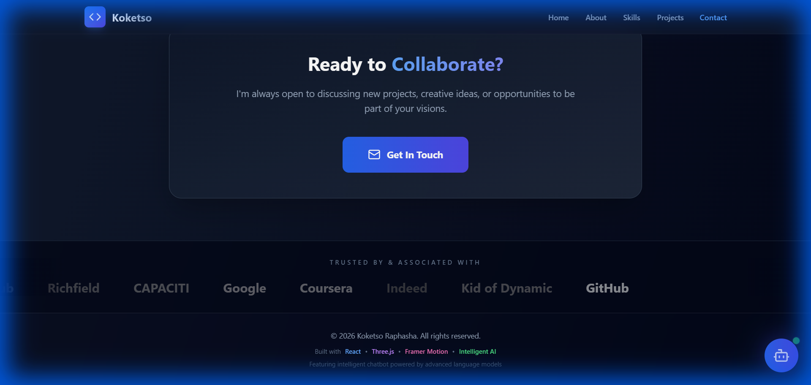
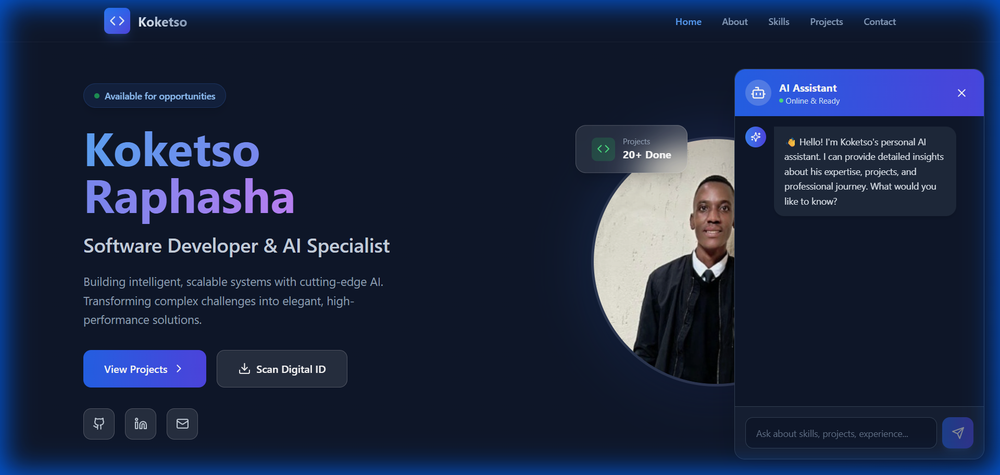

# Koketso Raphasha | Professional Portfolio



## 🚀 Overview

A high-performance, immersive 3D personal portfolio built with **React**, **Three.js**, and **Framer Motion**. This project showcases my skills as a Software Developer & AI Specialist, featuring a glassmorphic design, intelligent AI chatbot, and interactive elements.

🔗 **Live Demo:** [https://koketso-portfolio-premium.vercel.app](https://koketso-portfolio-premium.vercel.app)

## ✨ Key Features

### 🤖 Intelligent AI Chatbot
A personal AI assistant trained on my professional background.
- **Natural Language Understanding**: Ask about my skills, projects, or contact info.
- **Dynamic Responses**: Provides detailed, context-aware answers.
- **Glassmorphic UI**: Beautifully designed chat interface.



### 📲 Mobile Digital ID Scanner
Integrated QR code scanner for instant contact sharing.
- **Responsive Design**: Optimized for Android & iOS screens.
- **One-Tap Access**: Located in the Hero section and Mobile Menu.
- **Direct GitHub Link**: Scans to verify credentials via GitHub.


### 🤝 Trusted Associates
Seamless scrolling slider showcasing professional affiliations.
- **Infinite Animation**: Smooth left-to-right marquee.
- **Interactive Logos**: Grayscale to color hover effects.

## 🛠️ Tech Stack

- **Frontend**: React, Vite, Tailwind CSS
- **Animations**: Framer Motion, GSAP
- **3D Graphics**: React Three Fiber, Drei
- **Icons**: Lucide React
- **Deployment**: Vercel

## 🚀 Getting Started

1.  **Clone the repository**
    ```bash
    git clone https://github.com/Raphasha27/Portfolio.git
    ```
2.  **Install dependencies**
    ```bash
    npm install
    ```
3.  **Generate the Resume PDF**
    ```bash
    node scripts/generate_resume.js
    ```
4.  **Run the development server**
    ```bash
    npm run dev
    ```

## 📬 Contact

- **Email**: contact@koketso.dev
- **LinkedIn**: [Koketso Raphasha](https://linkedin.com/in/koketso-raphasha)
- **GitHub**: [Raphasha27](https://github.com/Raphasha27)

---
© 2026 Koketso Raphasha. All rights reserved.
