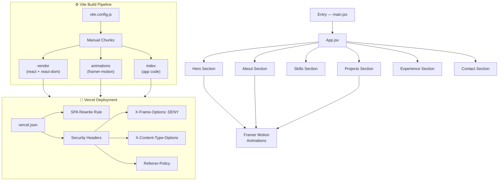

<div align="center">

[](https://portfolio-iota-eight-90.vercel.app)

<br/>

[](https://react.dev)
[](https://vite.dev)
[](https://www.framer.com/motion/)
[](https://portfolio-iota-eight-90.vercel.app)
[](LICENSE)

</div>

---

## 🧠 About

This is the personal developer portfolio of **Koketso Raphasha** — Autonomous AI Engineer, Full Stack Developer, and Blockchain integrator based in South Africa.

The portfolio was built to solve one problem: **most developer portfolios are static, forgettable, and generic.** This site is a living, animated showcase of real-world engineering work — from multi-agent AI pipelines to blockchain-integrated dApps — presented with a premium, fluid UI that reflects the quality of the underlying work.

> *Built for the African Future. Engineered for a global stage.*

---

## 🌐 Live Demo

**🔗 [portfolio-iota-eight-90.vercel.app](https://portfolio-iota-eight-90.vercel.app)**

Deployed on Vercel with production build optimizations and security hardening. Zero cold-start latency — fully static SPA.

---

## ✨ Features

| Feature | Description |
|---|---|
| ⚡ **Blazing Performance** | Vite 7 + esbuild minification with vendor chunk splitting — ships <600 KB per chunk |
| 🎨 **Fluid Animations** | Framer Motion 12 for scroll-triggered reveals, hero transitions, and card entrances |
| 🧱 **Section Architecture** | Hero, About, Skills, Projects, Experience, Contact — all modular React components |
| 🔐 **Security Hardened** | CSP meta tag, Vercel security headers (X-Frame, XSS-Protection, Referrer Policy) |
| 📱 **Fully Responsive** | Mobile-first layout across all viewport sizes |
| 🔍 **SEO-Optimised** | Full Open Graph, Twitter Card, JSON-LD structured data, and canonical URL |
| 🌍 **Google Fonts** | Inter + Space Grotesk loaded via preconnect for minimal FOIT |
| 🌙 **Dark-by-Default** | Deep navy/teal dark theme reflecting a systems-level, terminal aesthetic |

---

## 🗺️ Architecture


```mermaid
graph TD
    A["Entry — main.jsx"] --> B["App.jsx"]
    B --> C["Hero Section"]
    B --> D["About Section"]
    B --> E["Skills Section"]
    B --> F["Projects Section"]
    B --> G["Experience Section"]
    B --> H["Contact Section"]

    C --> FM["Framer Motion\nAnimations"]
    D --> FM
    F --> FM

    subgraph Build ["⚙️ Vite Build Pipeline"]
        VE["vite.config.js"] --> CHUNK["Manual Chunks"]
        CHUNK --> V["vendor\n(react + react-dom)"]
        CHUNK --> AN["animations\n(framer-motion)"]
        CHUNK --> APP["index\n(app code)"]
    end

    subgraph Deployment ["🚀 Vercel Deployment"]
        VJ["vercel.json"] --> REWRITE["SPA Rewrite Rule"]
        VJ --> HEADERS["Security Headers"]
        HEADERS --> H1["X-Frame-Options: DENY"]
        HEADERS --> H2["X-Content-Type-Options"]
        HEADERS --> H3["Referrer-Policy"]
    end

    APP --> Deployment
    V --> Deployment
    AN --> Deployment
```

---

## 🚀 Quick Start

### Prerequisites

- **Node.js** ≥ 18.x
- **npm** ≥ 9.x

### Local Development

```bash
# 1. Clone the repository
git clone https://github.com/Raphasha27/portfolio.git
cd portfolio

# 2. Navigate to the v2 source (active version)
cd v2

# 3. Install dependencies
npm install

# 4. Start the dev server (LAN accessible)
npm run dev
```

The app runs at **`http://localhost:5173`** by default (also accessible on your local network via the printed IP).

### Production Build

```bash
# Inside the v2/ directory
npm run build

# Preview the production build locally
npm run preview
```

### Deploy to Vercel

The project is configured for zero-config Vercel deployment via `vercel.json`:

```bash
vercel --prod
```

---

## 🔑 Environment Variables

The project uses a minimal environment footprint. Copy `.env.example` to `.env.local` and fill in any required values:

| Variable | Required | Description |
|---|---|---|
| `VITE_CONTACT_FORM_ENDPOINT` | Optional | Backend or third-party endpoint for the contact form (e.g. Formspree URL) |
| `VITE_GA_MEASUREMENT_ID` | Optional | Google Analytics 4 measurement ID (`G-XXXXXXXX`) |
| `VITE_SITE_URL` | Optional | Canonical base URL, defaults to `https://portfolio-iota-eight-90.vercel.app` |

> **Never commit `.env` or `.env.local` to version control.** Both are listed in `.gitignore`.

---

## 🛠️ Tech Stack

| Layer | Technology |
|---|---|
| **UI Framework** | [React 19](https://react.dev) |
| **Build Tool** | [Vite 7](https://vite.dev) with esbuild |
| **Animations** | [Framer Motion 12](https://www.framer.com/motion/) |
| **Styling** | CSS Modules / vanilla CSS with CSS variables |
| **Typography** | Inter, Space Grotesk (Google Fonts) |
| **Deployment** | [Vercel](https://vercel.com) |
| **Linting** | ESLint 9 with react-hooks + react-refresh plugins |

---

## 📂 Project Structure

```
portfolio/
├── v2/                      # Active portfolio (React + Vite)
│   ├── src/
│   │   ├── components/      # Section components (Hero, About, Skills…)
│   │   ├── assets/          # Images, icons, static assets
│   │   ├── App.jsx
│   │   └── main.jsx
│   ├── public/              # Static files copied verbatim to dist/
│   ├── index.html           # App shell with SEO + CSP meta
│   └── vite.config.js       # Build optimisation config
├── vercel.json              # Deployment + security headers
├── .gitignore
└── README.md
```

---

## 🗓️ Roadmap

- [x] Hero + About + Skills sections
- [x] Projects showcase with live links
- [x] Framer Motion scroll animations
- [x] SEO meta tags + JSON-LD structured data
- [x] Vercel security headers
- [x] Production build optimisation (code splitting)
- [ ] Blog / devlog section (MDX powered)
- [ ] Project detail modal with case study view
- [ ] Dark / Light theme toggle
- [ ] Contact form with backend validation
- [ ] Web3 wallet integration demo section
- [ ] i18n support (English + Zulu)

---

## 🤝 Contributing

Contributions, issues and feature requests are welcome! See [CONTRIBUTING.md](CONTRIBUTING.md) for guidelines and [CODE_OF_CONDUCT.md](CODE_OF_CONDUCT.md) for community standards.

---

## 🔒 Security

If you discover a security vulnerability, please follow the process outlined in [SECURITY.md](SECURITY.md). Do **not** open a public issue.

---

## 📄 License & Author

<div align="center">

**Koketso Raphasha** — [@Raphasha27](https://github.com/Raphasha27)

© 2026 **Kirov Dynamics Technology**. All rights reserved.

Released under the [MIT License](LICENSE).

[](https://portfolio-iota-eight-90.vercel.app)

</div>
